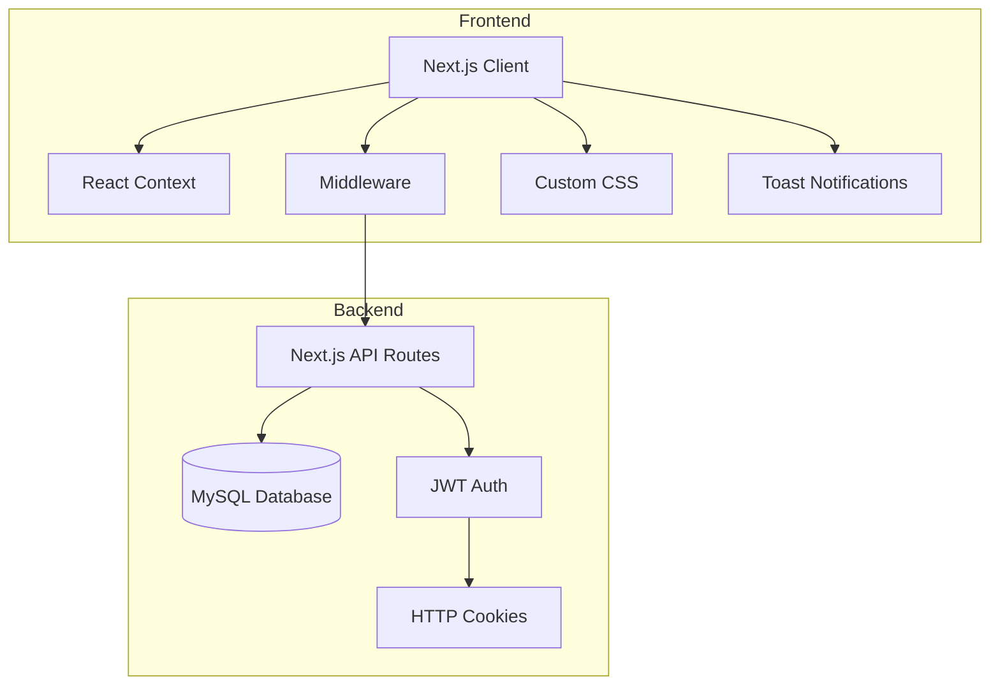
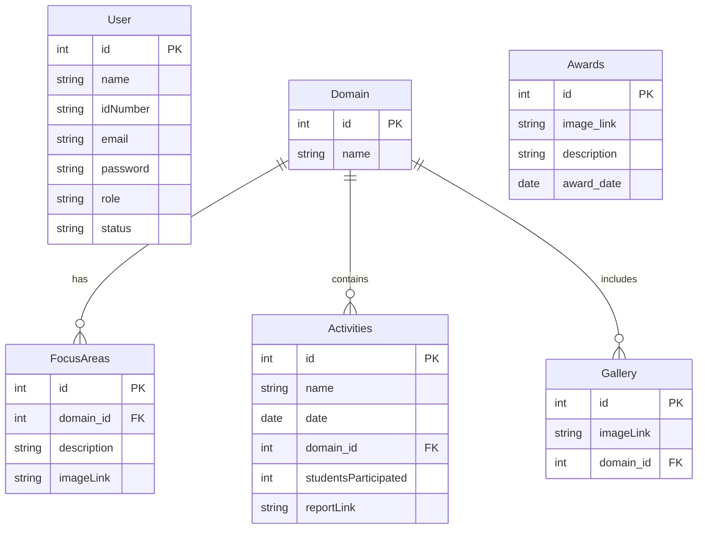
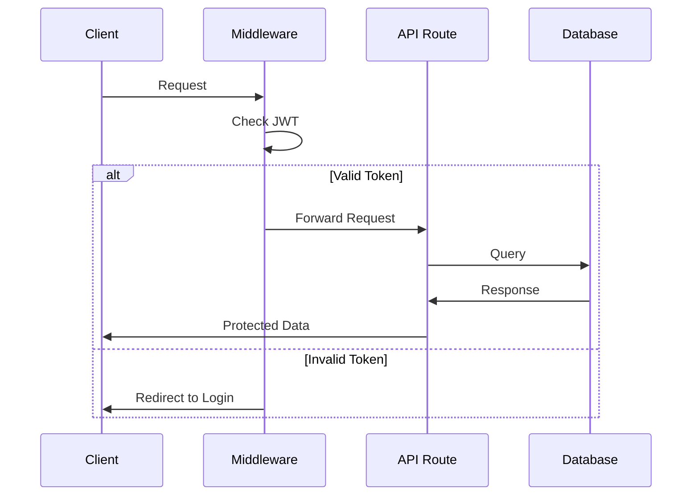
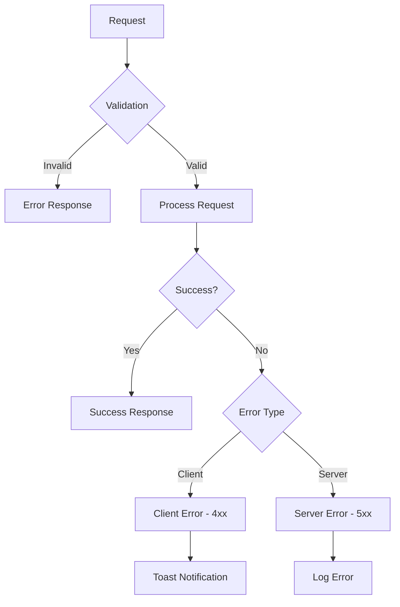

# Smart Village Revolution Portal - System Diagrams

## System Architecture



## API Routes Structure

```mermaid
graph LR
    subgraph Authentication
        L[/api/auth/login]
        LO[/api/auth/logout]
        C[/api/auth/check]
        FP[/api/auth/forgot-password]
        RP[/api/auth/reset-password]
    end

    subgraph Dashboard
        subgraph Admin
            AM[/api/dashboard/admins]
            CP[/api/dashboard/change-password]
        end

        subgraph Content
            FA[/api/dashboard/focusd]
            AC[/api/dashboard/activities]
            GL[/api/dashboard/gallery]
            AW[/api/dashboard/awards]
        end
    end
```

## Database Schema



## Frontend Routes Map

```mermaid
graph TD
    subgraph Public
        H[/] --> L[/auth/login]
        H --> FP[/auth/forgot-password]
        H --> AC[/activities]
    end

    subgraph Protected
        D[/dashboard]
        D --> P[/dashboard/profile]
        D --> MA[/dashboard/manage-admins]
        D --> DA[/dashboard/activities]
        D --> DF[/dashboard/focus]
        D --> DG[/dashboard/gallery]
        D --> DAW[/dashboard/awards]
    end

    L --> D
```

## Security Flow



## Error Handling Flow


